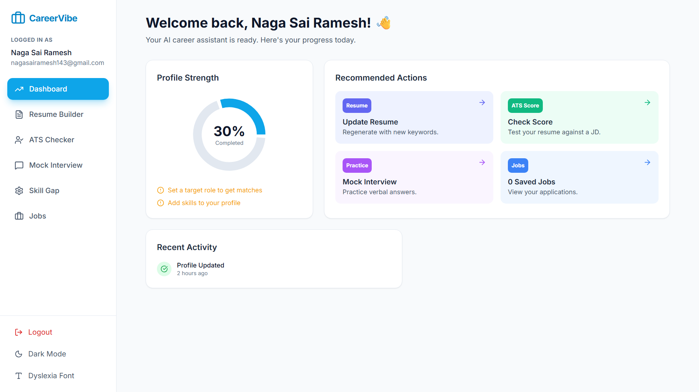
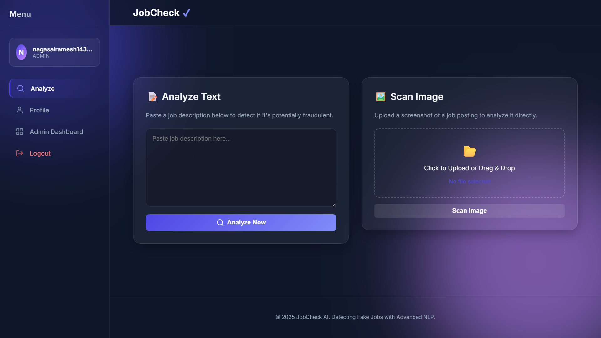
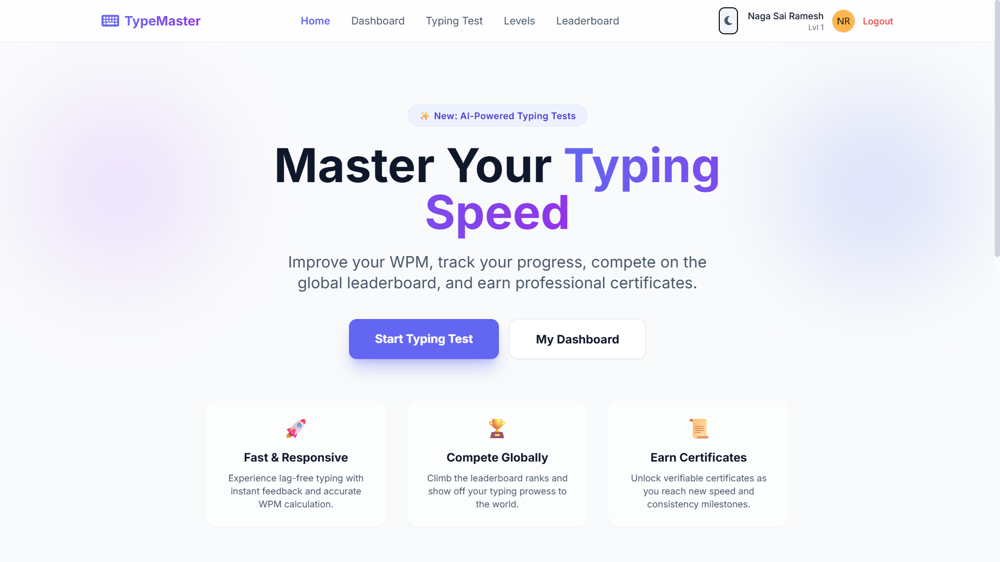

# Naga Sai Ramesh – Personal Portfolio

A modern, responsive, and interactive personal portfolio web application built with **React 19**, **TypeScript**, **Vite**, and **Tailwind CSS**, featuring dynamic **Framer Motion** animations and an **AI Portfolio Assistant** powered by the **Google Gemini API**.

---

## 🔗 Live Demos

- **Portfolio Website:** [https://nagasai-portfolio.com](https://nagasai-portfolio.com)
- **JobCheck Demo:** [https://job-check-nlp-new.onrender.com](https://job-check-nlp-new.onrender.com/)
- **CareerVibe AI Demo:** [https://careervibe-frontend.onrender.com](https://careervibe-frontend.onrender.com/)
- **TypeMaster AI Demo:** [https://typing-speed-evaluation-system-with.vercel.app/](https://typing-speed-evaluation-system-with.vercel.app/)
- **Smart Tourist Weather Demo:** [https://live-weather-app-drab.vercel.app/](https://live-weather-app-drab.vercel.app/)

---

## 📖 Table of Contents

- [About the Project](#-about-the-project)
- [Key Features](#-key-features)
- [Project Screenshots](#-project-screenshots)
- [Tech Stack](#-tech-stack)
- [Project Structure](#-project-structure)
- [Featured Projects](#-featured-projects)
- [Getting Started](#-getting-started)
  - [Prerequisites](#prerequisites)
  - [Installation](#installation)
  - [Environment Variables](#environment-variables)
  - [Development Server](#development-server)
- [Build and Deployment](#-build-and-deployment)
  - [Production Build](#production-build)
  - [Preview Build](#preview-build)
  - [Deploying to Vercel](#deploying-to-vercel)
- [Contact](#-contact)
- [License](#-license)

---

## 💡 About the Project

This portfolio serves as a comprehensive, recruiter-ready showcase of **Naga Sai Ramesh Kunapalli**—a Full Stack Developer and MCA student at JNTU Gurajada Vizianagaram. 

Designed with a sleek dark glassmorphism aesthetic, it highlights:
- Hands-on full-stack and AI engineering experience across production-grade personal projects and industry internships.
- Technical expertise across frontend engineering, backend API architecture, databases, and machine learning pipelines.
- An interactive AI Assistant that allows recruiters and visitors to ask conversational questions about skills, background, and availability in real time.

---

## ✨ Key Features

- **Modern Glassmorphism UI:** Built on an ultra-dark background (`#030712`) with frosted glass panels, fluid gradient typography, and custom ambient glowing effects.
- **Fluid Micro-Animations:** Smooth section transitions, interactive hover lifts, and spring animations driven by **Framer Motion**.
- **Hero Section with Dynamic Typing:** Real-time typewriter effect cycling through core roles, quick stats badges, social shortcuts, and one-click resume download.
- **AI Portfolio Assistant:** Floating conversational chat widget powered by the **Google Gemini API** (`gemini-2.5-flash`), delivering streaming responses to user inquiries about technical skills, projects, and contact details.
- **Comprehensive Project Showcase:** Rich project cards with tech tags, GitHub repository links, live demos, and an in-depth modal breakdown detailing key features, architectural highlights, and engineering challenges solved.
- **Visual Skill Matrix:** Categorized technical competencies (Languages, Web Technologies, Core Concepts, Tools) paired with proficiency bars and Lucide icons.
- **Professional Timeline:** Interactive vertical timeline detailing work history and internships (Infosys Springboard, SmartBridge).
- **Academic Milestones & Verified Certifications:** Track record of degrees, CGPA scores, and verifiable certificate links (IIT Kharagpur NPTEL, Infosys Springboard, SmartBridge, GenAiVersity).
- **Direct Contact Channel:** Built-in contact form generating structured email drafts, accompanied by direct communication channels.
- **Static Portfolio Fallback:** Standalone vanilla HTML/CSS/JS version maintained in `static-portfolio/` for serverless or zero-runtime environments.

---

## 📸 Project Screenshots

| Project | Preview |
| :--- | :--- |
| **CareerVibe AI**<br>AI-driven career preparation platform |  |
| **JobCheck**<br>Fake job detection system using NLP |  |
| **TypeMaster AI**<br>Typing evaluation & certificate system |  |
| **Smart Tourist Weather**<br>Real-time climate forecast platform |  |

---

## 🛠️ Tech Stack

### Core Technologies
| Layer | Technologies |
| :--- | :--- |
| **Frontend Framework** | [React 19](https://react.dev/) (`react`, `react-dom` v19.2.4) |
| **Language** | [TypeScript](https://www.typescriptlang.org/) (v5.8) |
| **Build Tool & Bundler** | [Vite](https://vitejs.dev/) (v6.2) |
| **Styling & Design** | [Tailwind CSS](https://tailwindcss.com/) & Vanilla CSS Design System (`index.css`) |
| **Animations** | [Framer Motion](https://www.framer.com/motion/) (v12.42) |
| **Iconography** | [Lucide React](https://lucide.dev/) (v0.475) |
| **AI Integration** | [Google Gen AI SDK](https://github.com/google-gemini/generative-ai-js) (`@google/genai` v1.38) |

---

## 📁 Project Structure

```
Portfolio-main/
├── .env.example                 # Environment variables template
├── .gitignore                   # Git exclusion rules
├── App.tsx                      # Root application layout & section assembler
├── constants.tsx                # Portfolio data store (Projects, Skills, Timeline)
├── index.css                    # Global tokens, glassmorphism styles & animations
├── index.html                   # HTML entry point with font & CDN links
├── index.tsx                    # React application entrypoint
├── metadata.json                # Project description & permission metadata
├── package.json                 # Project dependencies & npm scripts
├── tsconfig.json                # TypeScript compiler configuration
├── types.ts                     # TypeScript interfaces and model definitions
├── vite.config.ts               # Vite configuration & environment definition
│
├── components/                  # Modular React UI components
│   ├── AIAssistant.tsx          # Gemini-powered floating chat interface
│   ├── About.tsx                # About Me narrative & mission cards
│   ├── Achievements.tsx         # Highlights, community metrics & milestones
│   ├── Certifications.tsx       # Verified certification gallery
│   ├── Contact.tsx              # Contact form & social channels
│   ├── Education.tsx            # Academic background & credentials
│   ├── Experience.tsx           # Vertical internship timeline
│   ├── Footer.tsx               # Footer copyright & links
│   ├── Hero.tsx                 # Hero banner, typewriter & stats
│   ├── Navbar.tsx               # Responsive sticky navbar with indicators
│   ├── Projects.tsx             # Featured projects grid & modal details
│   └── Skills.tsx               # Categorized technical skill matrix
│
├── public/                      # Static assets served at root
│   ├── Naga_Sai_Ramesh_Resume.pdf
│   ├── Profile Pic.png
│   ├── Typingmaster.png
│   ├── careerVibeai.png
│   ├── jobcheckfrontpage.png
│   ├── live weather.png
│   └── resume.html
│
└── static-portfolio/            # Standalone static HTML/CSS/JS fallback
    ├── index.html
    ├── script.js
    └── styles.css
```

---

## 🚀 Featured Projects

| Project | Description | Tech Stack | Links |
| :--- | :--- | :--- | :--- |
| **CareerVibe AI** | AI-driven career prep platform leveraging Google Gemini API for personalized resume feedback and mock interviews with <100ms latency. | React, TypeScript, Gemini API, Node.js, Vite | [Live Demo](https://careervibe-frontend.onrender.com) \| [Source Code](https://github.com/NagaSaiRamesh06/CareerVibe-AI) |
| **JobCheck** | NLP-based recruitment fraud detection system achieving 92% accuracy in identifying fake job postings with SMOTE balancing. | Python, NLP, Scikit-learn, React, FastAPI | [Live Demo](https://job-check-nlp-new.onrender.com) \| [Source Code](https://github.com/NagaSaiRamesh06/JobCheck) |
| **TypeMaster AI** | Typing speed evaluation system featuring custom HTML5 Canvas certificate generation and real-time accuracy tracking. | React, TypeScript, Tailwind, Canvas API | [Live Demo](https://typing-speed-evaluation-system-with.vercel.app/) \| [Source Code](https://github.com/NagaSaiRamesh06/TypeMaster) |
| **Smart Tourist Weather** | Real-time weather forecasting application providing live climate data, multi-day forecasts, and local caching. | JavaScript, Weather API, HTML/CSS | [Live Demo](https://live-weather-app-drab.vercel.app/) \| [Source Code](https://github.com/NagaSaiRamesh06/WeatherApp) |

---

## ⚙️ Getting Started

### Prerequisites

Ensure you have the following installed on your local machine:
- **Node.js** (v18.0.0 or higher recommended)
- **npm** (v9.0.0 or higher) or **yarn** / **pnpm**
- **Git**

### Installation

1. Clone the repository to your local machine:
   ```bash
   git clone https://github.com/NagaSaiRamesh06/Portfolio.git
   ```

2. Navigate into the project directory:
   ```bash
   cd Portfolio
   ```

3. Install project dependencies:
   ```bash
   npm install
   ```

### Environment Variables

The project uses the Google Gemini API to power the interactive AI Portfolio Assistant.

1. Create a `.env` file in the root directory by copying `.env.example`:
   ```bash
   cp .env.example .env
   ```

2. Open `.env` and add your Google Gemini API key:
   ```env
   # Gemini API Key for the AI Portfolio Assistant
   # Obtain a key from Google AI Studio: https://aistudio.google.com/
   GEMINI_API_KEY=your_gemini_api_key_here
   ```

> **Note:** The `.env` file is excluded in `.gitignore` to prevent sensitive credentials from being committed to GitHub.

### Development Server

Start the local Vite development server:
```bash
npm run dev
```

The application will be accessible at `http://localhost:3000/`.

---

## 📦 Build and Deployment

### Production Build

To compile and bundle the application for production:
```bash
npm run build
```

This triggers the TypeScript compiler (`tsc`) and Vite build pipeline, outputting optimized, minified static files into the `dist/` folder.

### Preview Build

To test the production build locally prior to deployment:
```bash
npm run preview
```

### Deploying to Vercel

This repository is optimized for one-click deployment on [Vercel](https://vercel.com/):

1. Push your latest code to your GitHub repository.
2. In the Vercel dashboard, click **Add New Project** and import `Portfolio`.
3. Configure the project settings:
   - **Framework Preset:** `Vite`
   - **Root Directory:** `./`
   - **Build Command:** `npm run build`
   - **Output Directory:** `dist`
4. Under **Environment Variables**, add:
   - `GEMINI_API_KEY` = *your Gemini API key*
5. Click **Deploy**. Vercel will build and serve your portfolio globally.

---

## 📬 Contact

- **Name:** Naga Sai Ramesh Kunapalli
- **Email:** [nagasairameshkunapalli@gmail.com](mailto:nagasairameshkunapalli@gmail.com)
- **LinkedIn:** [linkedin.com/in/naga-sai-ramesh-kunapalli-023798283](https://linkedin.com/in/naga-sai-ramesh-kunapalli-023798283)
- **GitHub:** [github.com/NagaSaiRamesh06](https://github.com/NagaSaiRamesh06)
- **YouTube:** [youtube.com/@nagasairamesh06](https://youtube.com/@nagasairamesh06)
- **Instagram:** [instagram.com/naga_sai_ramesh_kunapalli](https://instagram.com/naga_sai_ramesh_kunapalli)

---

## 📄 License

This repository and its source code are personal portfolio materials of Naga Sai Ramesh Kunapalli. Feel free to browse, review, and fork this project for personal learning or inspiration.